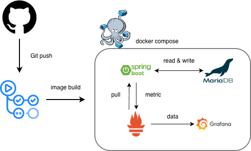

## Ticketing Service

위 서비스는 공연 등의 행사를 티켓 예매를 진행해주는 back-end 서비스입니다.

특히 티켓 예매 같은 경우 자리를 지정하여 예약을 진행할 뿐만 아니라 랜덤으로 좌석을 지정하여 예약이 진행할 수 있습니다. 

## 아키텍쳐

아키텍쳐는 다음과 같이 구성되어 있습니다.



## 작동방법

위 프로젝트는 여러 컨테이너를 `Docker Compose` 형태로 묶은 어플리케이션입니다.

다음과 같은 명령어로 실행이 가능합니다.

```agsl
docker compose up --build
```

`docker compose`가 설치되지 않지 않은 경우 [위 링크에서 Docker Desktop을 설치해주세요.](https://www.docker.com/get-started/)

### 환경 값 설정

위 프로젝트를 실행 할 경우 다음과 같은 env를 설정하여야 합니다.

- `MARIADB_USER` : DB 사용자 이름을 설정합니다.
- `MARIADB_ROOT_PASSWORD` : DB 비밀번호를 설정합니다.
- `MARIADB_DATABASE` : DB 데이터베이스 이름을 설정합니다.
- `MARIADB_URL` : DB 주소을 설정합니다.
- `SERVER_URL` : Server 컨테이너 주소를 설정합니다.
- `SERVER_PORT` : Server 포트를 설정합니다. (default : 8000)
- `WEB_EXPOSURE` : Server 컨테이너 `/actuator`에 노출 시킬 엔드포인트를 설정합니다. (default : health,prometheus)

## API 설명

`/ticketing` : 티켓을 예약해주는 API입니다. (단, 예약시 `concertId`, `seatclassId`, `stageId`, `userId가` 필요합니다.)
- `[POST] /ticket/{seat}` : 지정된 좌석(seat)으로 티켓 예약을 진행합니다.
- `[POST] /ticket/random` : 랜덤된 좌석으로 티켓 예약을 진행합니다.

`/concert` : 공연을 설정합니다.

`/seat-class` : 공연 내 좌석정보를 설정합니다.

`/stage` : 공연 내 시간표를 설정합니다.

`/user` : 사용자를 설정합니다.

## Releases

- `1.0.0` : 2025/12/12

## Contributors

- [riroan](https://github.com/riroan)